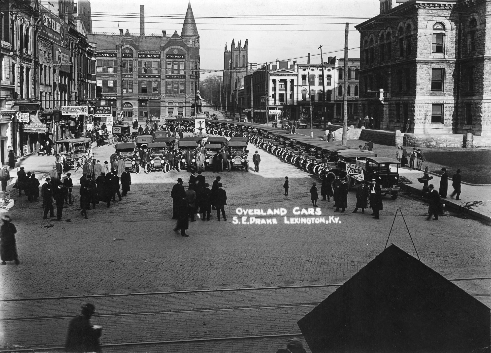
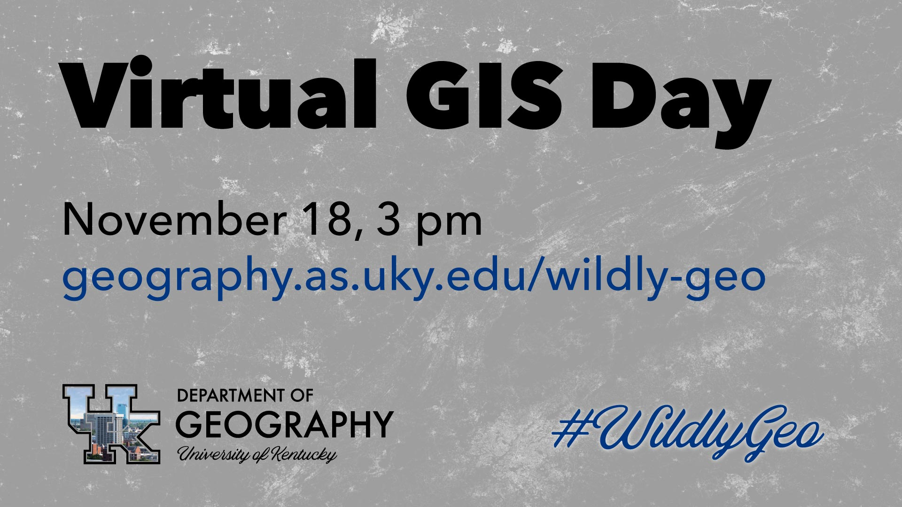

---?image=assets/pot-background.jpg&opacity=20
# Geo Awareness Month
## October 28 — November 18

---
## Overview
@ul
* A short event each Wednesday @ 3pm announcing an asynchronous event. 
* A raffle each day for maps!
@ulend

---
## Full schedule
[geography.as.uky.edu/wildly-geo](https://geography.as.uky.edu/wildly-geo)

---
[drag=50 80, drop=0 0]
### Mapping & Data Viz contest
## Oct 28
@ul
* Submit and vote on best viz
* Prizes for Geography majors & minors
@ulend
[drop=right]

---
[drag=50 80, drop=0 0]
### The "Wildcat" Geocache
## Nov 4
@ul
* High-tech treasure hunt
* Coordinates and clues online
@ulend
[drop=right]

---
[drag=50 80, drop=0 0]
### Rephotography Scavenger Hunt
## Nov 11
@ul
* Discover where historic Lexington photos were taken & rephotograph from same perspective
@ulend
[drop=right]

---
[drag=50 80, drop=0 0]
### GIS Day
## Nov 18
@ul
* One-hour synchronous event
* Presentations about maps!
* Awards announced
@ulend
[drop=right]

---?image=assets/wildly_geography.jpg&opacity=100